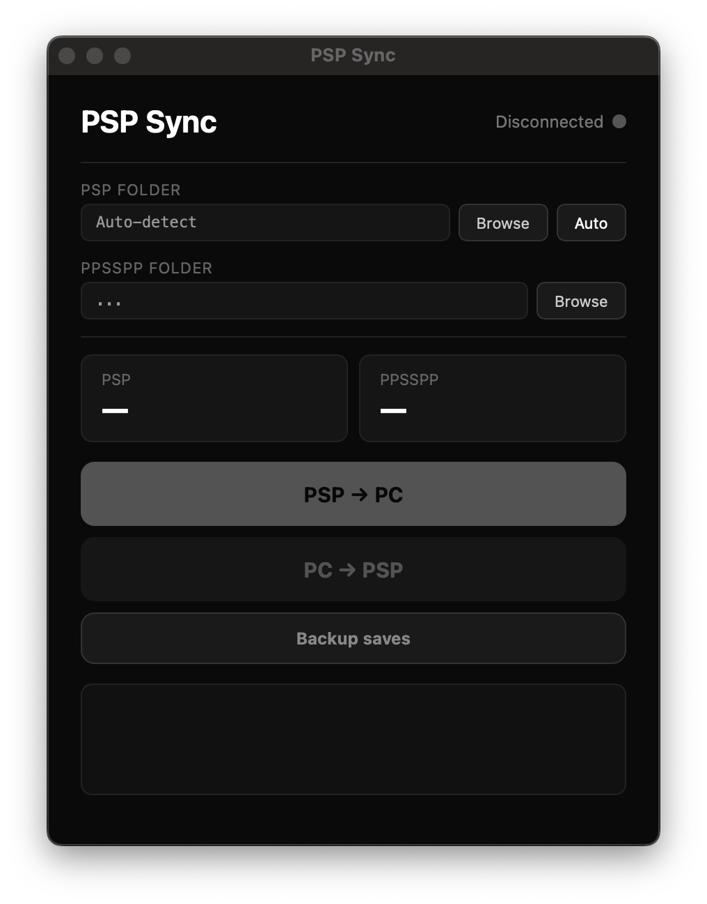

# PSP Sync



Sync save data between a real PSP and PPSSPP — works on macOS, Linux, and Windows.

## Features

- **PSP → PC** — Pull saves from your PSP before playing on PPSSPP
- **PC → PSP** — Push saves back to your PSP when you're done
- **Backup & Restore** — Manually backup your saves, restore any previous backup
- **Smart sync** — Only copies saves that are newer than the destination
- **Auto-detect** — Finds your PSP automatically when plugged in via USB
- **Custom folders** — Set custom PSP and PPSSPP paths, saved between sessions
- **Cross-platform** — Native rendering on macOS, Windows, and Linux

## Requirements

- Python 3.7+
- [pywebview](https://pywebview.flowrl.com/)

## Install & Launch

```bash
pip install pywebview
python3 pspsync.py
```

### Linux

```bash
pip install pywebview[gtk]
python3 pspsync.py
```

### Windows

```bash
pip install pywebview
python pspsync.py
```

## How it works

The app syncs the `PSP/SAVEDATA/` folder between your real PSP and a local directory used by PPSSPP.

| OS | PSP detection | Default PPSSPP path |
|---|---|---|
| macOS | `/Volumes/PSP` | `./PPSSPP-PSP/PSP/SAVEDATA/` |
| Linux | `/media/*/PSP` or `/mnt/PSP` | `./PPSSPP-PSP/PSP/SAVEDATA/` |
| Windows | Scans drive letters (D:\, E:\, ...) | `./PPSSPP-PSP/PSP/SAVEDATA/` |

Both paths are configurable via the UI. Settings are saved in `pspsync.json`.

Point PPSSPP to the `PPSSPP-PSP` folder as its memstick directory, and your saves will be shared.

## Backups

Click **Backup saves** to create a timestamped snapshot of your PPSSPP saves in the `backups/` folder. Each backup can be restored or deleted from the app.

## Only saves

PSP Sync only touches `PSP/SAVEDATA/` — no ISOs, no plugins, no system files.

---

*Made by [Noeme](https://github.com/romainguerif)*
